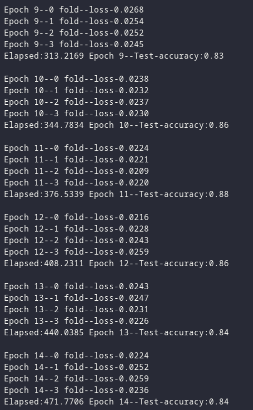

## Task1: Build a multi-layer neural network from scratch

My very first version network built from scratch (It looks ugly at the moment).
The only library used here is Numpy. The mode difficult part is calculating
partial derivatives in backpropagation. I found 3 different ways to calculate
the gradient.

Method 1: Calculating partial derivatives with respect to each weight and bia.
It is uneffecient but it is a good begining to understand how the a small change
in a parameter causes the change of the output.
[Tutorial](#tutorial-for-method-1)

Method 2: Using Jacobian matrix to find the gradient by calculate the
first-order partial derivatives between vectors.[Jacobian](#jacobian)

Method 3: Using a scalar function to find the gradient. The method is explained
in [Matrix Calculus](#matrix-calculus)

Best Train Scores:
|params		   ||
|:-------------|:-----------------------------------------------------|
|Network layers| 784-32-10|
|batch size    | 10	|
|train         | 40,000 images	|
|validation    | 400 images (4-fold-cross-validation: train:validation=0.99:0.01)|
|initialization for weights and bias| standard normal distribution	|
|learning rate | 0.1 |
|Epochs        | 15	|

Best Test Scores:

TODO

TODO:

1. ~~Fix training~~
2. Add numpy Type Hint
3. Add method 3

Referrences:

### Tutorial for Method 1
[building a neural network](http://neuralnetworksanddeeplearning.com/chap1.html)

### Jacobian
[Calculus for backpropagation---calculating gradient](https://www.youtube.com/watch?v=tIeHLnjs5U8)

### Matrix Calculus
[matrix calculus---alternative way to calculate gradient](https://www.youtube.com/watch?v=oGZK3yGF-6k)

## Task2: Build transformer from scratch

Referred to paper **Attention Is All You Need**
